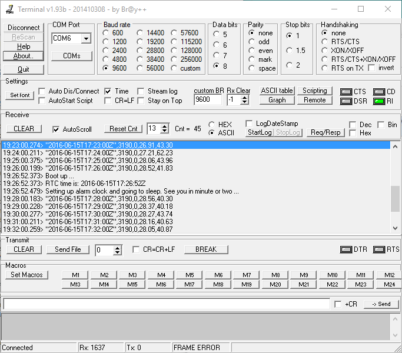

# weather_logger

## Goal

Building unattended, battery powered, off-line weather station.
Just for fun. 

## Goals:

- [ ] Runs 2 months or more on "reasonable" batteries (4x3000mAH at worst)
- [x] Monitors temperature, humidity, pressure and battery voltage
- [x] Logs data to SD card
- [ ] Survives rain, snow and reasonably low temperatures (let's say -15C)

## Tests:

- [x] RTC code (set alarm, wake on interrupt, read time, set time)
- [x] RTC set time via script (see rtc_set)
- [x] Estimate power consumption of Arduino Pro Mini 3.3V/8MHz
- [x] Estimate power consumption of SD card
- [x] SD card power shut-down and re-ininitalization
- [x] HTU21D temperature reading
- [x] BMP180 pressure reading
- [x] Battery voltage monitor
- [x] VCC monitor
- [ ] No data corruption at low power (try to sleep forever)
- [x] No data corruption at low temperature

## Conclusions:

### RTC

RTC interrupt works, but not when RTC is powered from backup battery.
Purpose of battery is obviously to keep clock running, not to power up
whole circuit. It needs voltage regulator with very low quiescent current
and some electronic parts to power up Arduino.

### Power consumption of Arduino Pro Mini 8MHz/3.3V

- Running (i wrote it somewhere)
- Sleeping with power LED on - 1.6mA
- Sleeping with power LED gone - 230uA :-) (5.5mAh/day 170mAh/month)
- Sleeping with ADC off - To be done
- Sleeping with ADC off, BOD off - To be done

Power consumption was measured by multimeter, it's not changing in sleep.

### Power consumption of SD card

AMS1117-3.3V voltage regulator on adapter itself 2.2mA@5V :-( so i decided to
shut it down completely, perhaps I will decide to get good enough voltage 
regulator later.

It's possible to turn off power for SD card and intitalize it with SDFat 
library. Initialization takes very roughly 100ms. Power consumption of SD
card seems quite low (below 100uA idle tested on two Sandisk SD cards).

I don't want to use power regulator on Arduino, Arduino UNO had so week one
that most of the cards failed to initialize reliably and some operations damaged
filesystem. Arduino Pro Mini may have better voltage regular.
I tried to measure power consumption of SD cards with improvized osciloscope, 
but I can't detect short peaks. Conclusion is idle card is negligible, various 
cards can  take 15-50mA when SPI communication is ongoing and there are peaks 
caused by init/read/write/erase operations. 

TLDR:
- with power off - 0.000 :-) but don't forget to set pins D10-D13 to input before disconnecting power
- SCLK low - negligible cause of cheap voltage regulator that takes 2.2mA ... approx 90uA
- SPI communication - 15mA common, 50mA seen
- peak - over 100mA seen, 50mA common

NOTE: based on small sample of 5 SD cards. Most hungry is 32GB Kingston 
with 90MB/s read speed. Least hungry is 16MB Canon from 2005 ... i guess from IXUS55 digital camera.

NOTE: measured by Arduino/INA219-based 100Hz+ 1 channel osciloscope :-)

TODO: picture

*SD Card shutdown*

TODO: shutdown circuit test

TODO: shutdown circuit scheme & wiring

## Screenshot(s)   

